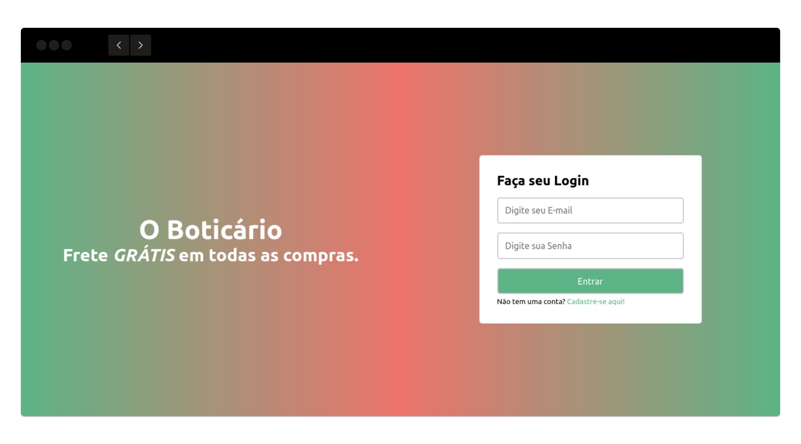
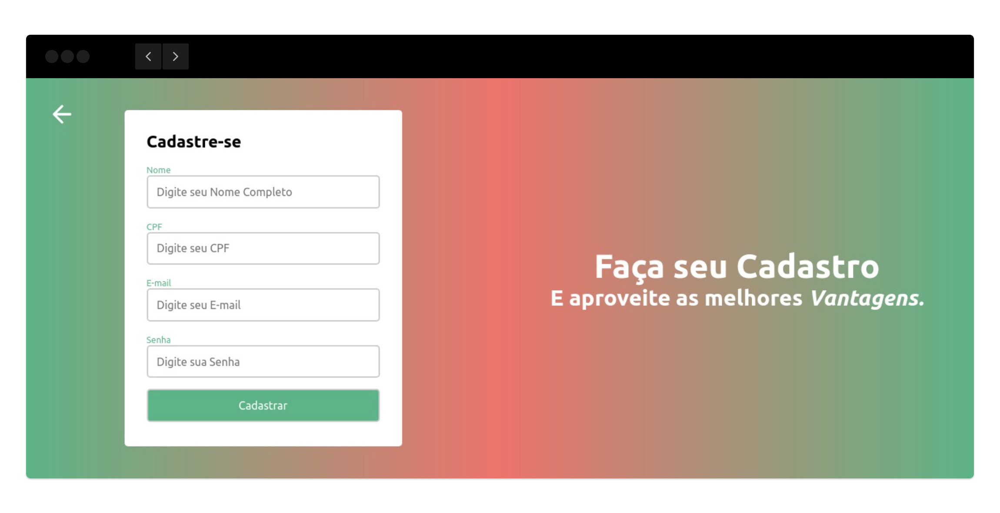
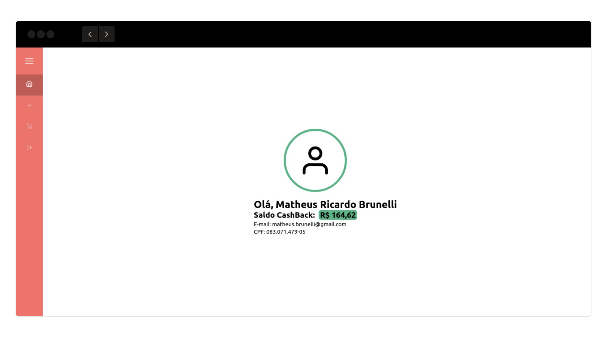
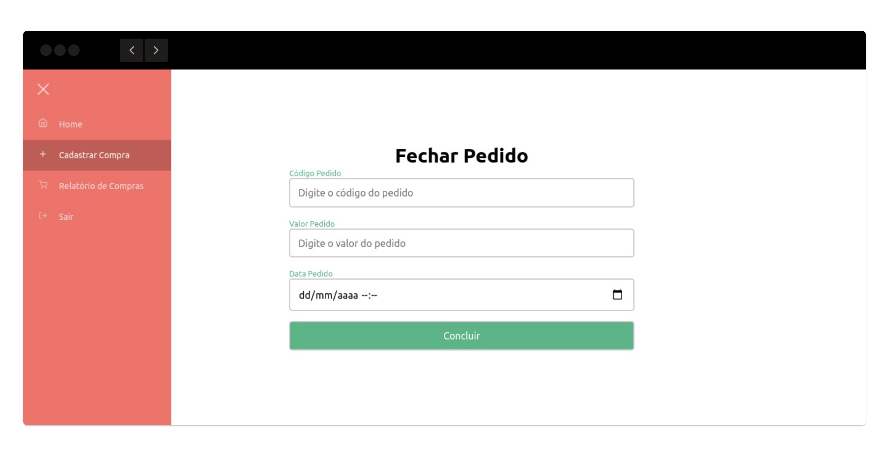
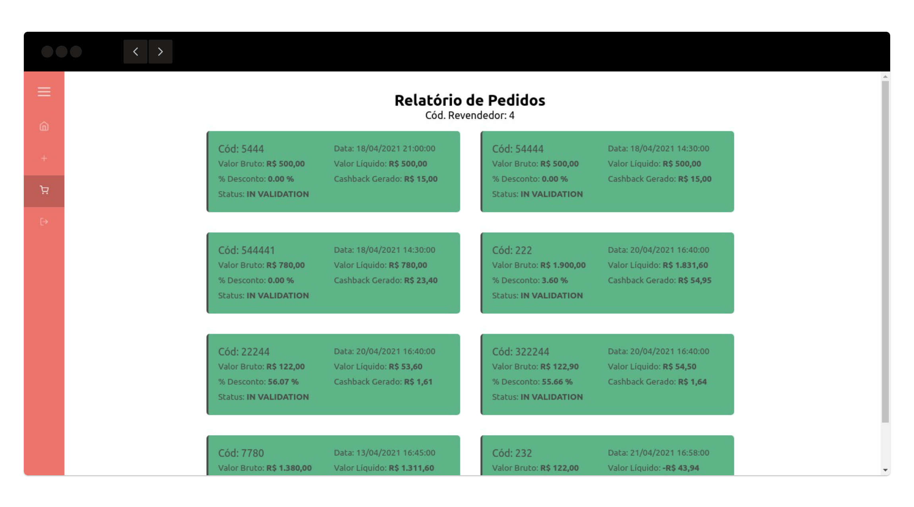

## Web App CashBack - O Boticário
> Sistema de CashBack para Revendedores Boticário

### Atenção!
##### Esse projeto depende do Back-End. Link aqui [mrbrunelli/cashback-boticario-api](https://github.com/mrbrunelli/cashback-boticario-api)

### Descrição
> É gerado 3% de CashBack em cada compra (com base no valor total do pedido), para ser utilizado como crédito no próximo pedido. O revendor tem acesso ao histórico de CashBack através da Tela de Relatório.

### Requisitos
- [x] Node 14^
- [x] NPM 6^

### Como executar
1. Primeiro deve instalar as dependências.
```sh
npm install
``` 

2. Executar em modo desenvolvimento.
```sh
npm run dev
```

3. Acessar em
```sh
http://localhost:3000/
```

### Screenshots da Aplicação
Tela de Login


Tela de Cadastro de Revendedor


Tela de Boas Vindas


Tela de Cadastro de Pedidos


Tela de Relatório de Pedidos e CashBack
